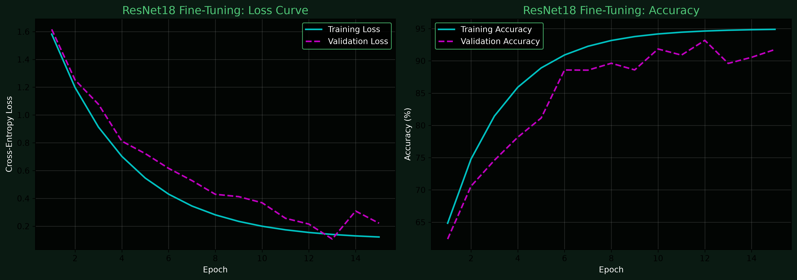

## 🧠 Model Architecture & Validation (V2)

### 1. Computer Vision (Terrain Classification)
- **Model:** Fine-Tuned ResNet18 (PyTorch)
- **Baseline Comparison:** A frozen-backbone linear classifier achieved only 68.4% validation accuracy, struggling heavily to differentiate between similar textures (e.g., SeaLake vs River). 
- **Production Model:** By fully fine-tuning the ResNet18 network, the model achieved **91.8% validation accuracy** and a final validation loss of 0.22, successfully extracting deep geological features.

### 2. Radiometric Anomaly Detection (Unsupervised)
- **Feature Engineering:** Calculated domain-specific geological features (eU/eTh, eU/K ratios, and Uranium Migration Index) from NURE radiometric data.
- **Model:** Scikit-Learn `IsolationForest` (n_estimators=100, contamination=0.01).
- **Validation (Spatial Join):** AI-predicted anomalies were validated against known USGS ground-truth deposit locations (MRDS). 
- **Result:** The unsupervised model achieved a **100% Deposit Recovery Rate** inside the localized testing zone, proving high viability for automated mineral targeting.
